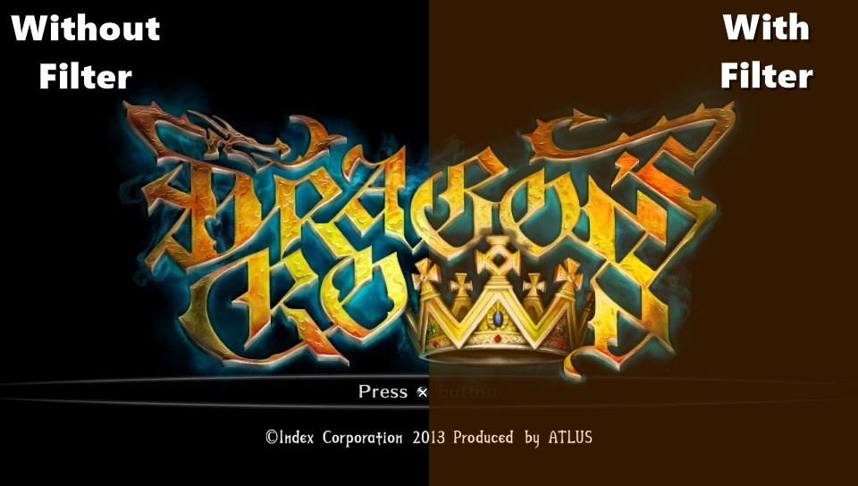

# VitaFlux 
Screen filter plugin for PS Vita.

I must mention, that this plugin is totally inspired by the idea of my friend @Applelo, https://github.com/Applelo/vFlux 
And adapted to the best use available in the VitaSDK and taiHen.

In this first version you can use an orange filter, which allows you to play without tiring your eyes at night (still requires you to lower the brightness for a better performance).

To install it:
Put the 'vflux.suprx' file in the 'ux0: tai /' path and add the following line to the txt 'config.txt' file located on the same path.

# Change TITLEID with your game id xD
*TITLEID
ux0:tai/vflux.suprx

Remember to use the 'Reload taiHen config.txt' function of MolecularShell.

### Ctrls: ###
 ### In Game: ###
 - Press Start and Select at the same time to show menu.
 ### In Menu: ##
 - Press Circle to close menu.
 - Press Left or Right pad to enable/disable filter.
